# مستندات نهایی فروشگاه مصالح ساختمانی

این پروژه یک **فروشگاه اختصاصی برای یک شرکت فروش مصالح ساختمانی** است؛ Marketplace و SaaS نیست. پیاده‌سازی با Laravel + Blade انجام شده و رابط کاربری فارسی، RTL، تاریخ جلالی و مبالغ ریالی دارد.

## خروجی نهایی سایت اصلی

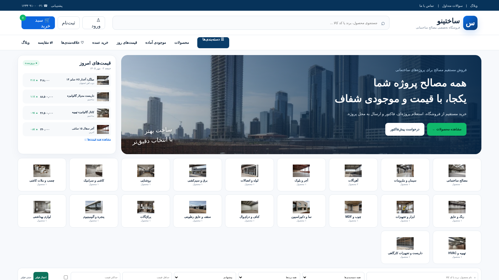

نسخه موبایل:

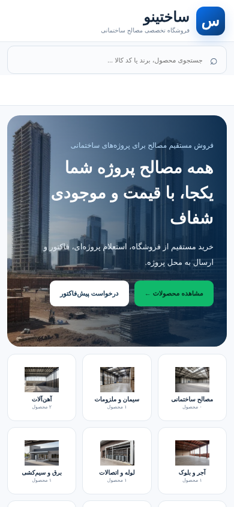

## خروجی نهایی پنل مدیریت

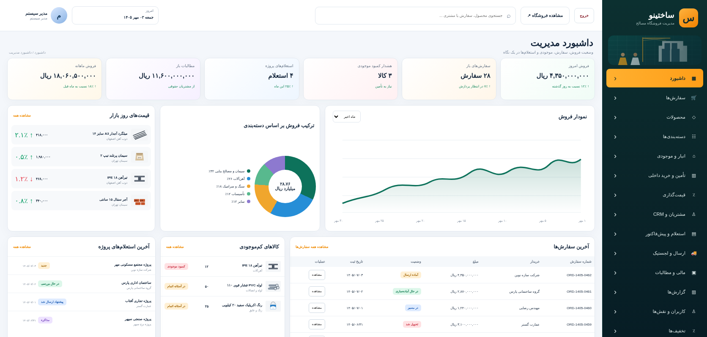

نسخه موبایل پنل:

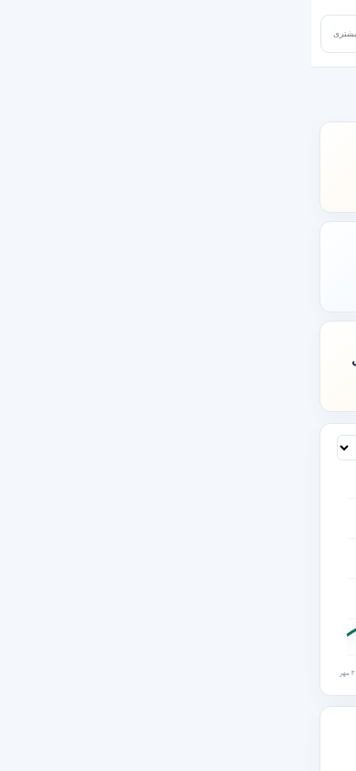

## صفحه محصول

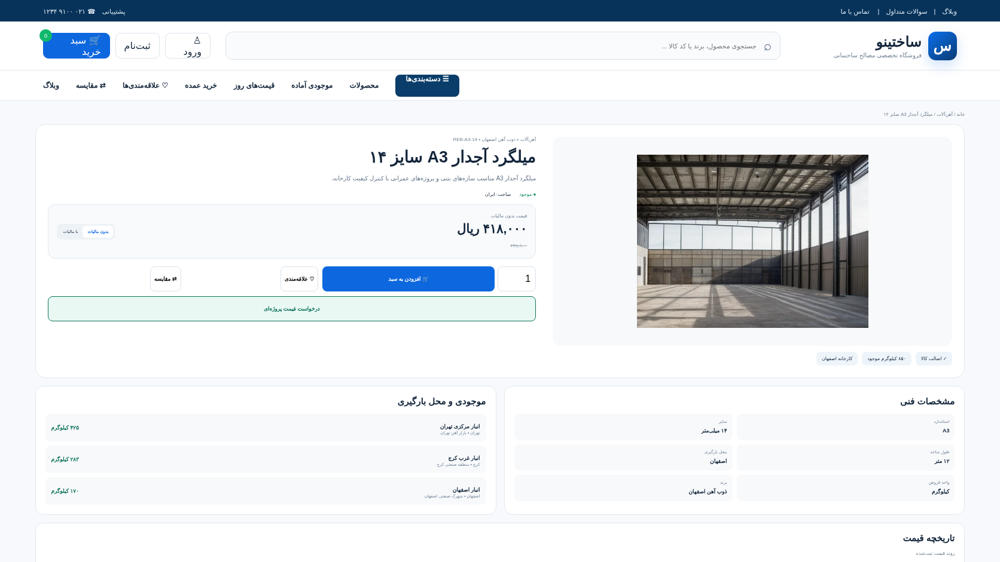

## پوشش امکانات

1. Login / Register / Logout، نقش Admin/User و حفاظت کامل `/admin` — انجام شد.
2. بازیابی رمز و پروفایل کاربری — انجام شد.
3. کاتالوگ حرفه‌ای، دسته‌بندی، برند، مشخصات فنی، فیلتر و مرتب‌سازی — انجام شد.
4. صفحه محصول، قیمت با/بدون مالیات، تاریخچه قیمت، موجودی و محل بارگیری — انجام شد.
5. علاقه‌مندی و مقایسه محصولات — انجام شد.
6. سبد خرید واقعی با تغییر تعداد و حذف کالا — انجام شد.
7. Checkout، آدرس، روش ارسال، روش پرداخت و صدور سفارش — انجام شد.
8. حساب مشتری، سفارش‌های من، جزئیات سفارش و رهگیری — انجام شد.
9. استعلام پروژه‌ای و پیش‌فاکتور مستقیم از همین شرکت — انجام شد.
10. خرید عمده و درخواست فروش اعتباری بدون شبکه فروشنده — انجام شد.
11. مدیریت محصولات، دسته‌بندی، قیمت، انبار و موجودی — انجام شد.
12. مدیریت سفارش، وضعیت پرداخت، ارسال و مرسوله — انجام شد.
13. مشتریان، CRM، مالی، مطالبات و گزارش‌ها — انجام شد.
14. مدیریت استعلام‌ها و پیش‌فاکتورها — انجام شد.
15. وبلاگ حرفه‌ای، محتوا و FAQ — انجام شد.
16. Meta، SEO، Sitemap و robots — انجام شد.
17. تنظیمات White-label شامل نام شرکت، لوگو، تلفن، ایمیل، آدرس و رنگ اصلی — انجام شد.
18. جلالی، ریال و RTL کامل — انجام شد.
19. مستندات تصویری در همین پوشه — انجام شد.
20. Feature Test برای Flowهای اصلی — انجام شد.
21. تست Chrome دسکتاپ و Responsive موبایل — انجام شد.
22. Commitهای مرحله‌ای و Push روی main — در مرحله انتشار نهایی.

## ماژول‌های واقعی پنل مدیریت

- داشبورد مدیریتی و KPI
- محصولات و ویرایش محصول
- دسته‌بندی
- انبار و موجودی چند انبار
- تأمین و خرید داخلی
- قیمت‌گذاری و ثبت تاریخچه قیمت
- سفارش‌ها و خروجی CSV
- استعلام پروژه و پیش‌فاکتور
- لجستیک، باربری و رهگیری
- مشتریان و CRM
- مالی و مطالبات
- گزارش‌های فروش و موجودی
- کاربران و نقش Admin/User
- کد تخفیف
- محتوا و وبلاگ
- تیکت پشتیبانی
- White-label Settings

## ساختار فنی

- Laravel 13
- Blade
- CSS / JavaScript بدون وابستگی فرانت‌اند سنگین
- SQLite برای نسخه Demo؛ قابل انتقال به MySQL/PostgreSQL
- Docker برای اجرای یکسان
- تاریخ نمایشی Jalali
- قیمت‌ها به Rial
- فایل‌های تصویری محصول و UI در `public/assets`
- Upload واقعی تصویر محصول، بلاگ و لوگو در پنل

## تست نهایی

آخرین اجرای Feature Tests:

- **11 تست پاس**
- **103 assertion پاس**
- Checkout شامل Order Item، Shipment، Financial Transaction و کاهش Stock تست شده است.
- Role Protection برای Admin/User تست شده است.
- Password Reset، Profile، Address، B2B Request، Product CRUD، Inventory، Order Status، Quote، White-label، Content، Supplier، Pricing، Logistics، User Role، Coupon و Ticket تست شده‌اند.

## تصاویر Chrome

- `final-home-desktop.png` — 1672×941
- `final-home-mobile.png` — 390×844
- `final-product.png` — 1672×941
- `final-admin-dashboard.png` — 1672×798
- `final-admin-mobile.png` — 390×844

## مسیرهای اصلی

- `/` فروشگاه
- `/product/{slug}` محصول
- `/cart` سبد خرید
- `/checkout` تسویه حساب
- `/account` حساب مشتری
- `/blog` وبلاگ
- `/faq` FAQ
- `/admin` پنل مدیریت
- `/admin/products` محصولات
- `/admin/orders` سفارش‌ها
- `/admin/inventory` موجودی
- `/admin/pricing` قیمت‌گذاری
- `/admin/logistics` لجستیک
- `/admin/customers` CRM
- `/admin/finance` مالی
- `/admin/reports` گزارش
- `/admin/settings` White-label

## گالری تصاویر واقعی جدید

تصاویر زیر مستقیماً در `public/assets/img/real/` استفاده می‌شوند و نسخه مستنداتی آن‌ها در `docs/images/real-assets/` قرار دارد.

| دسته | تصویر |
|---|---|
| کناف و درای‌وال | 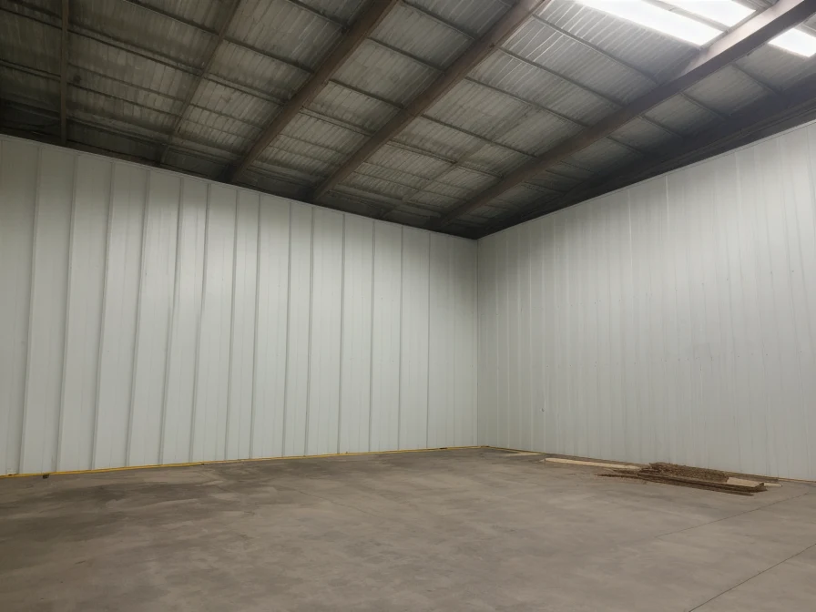 |
| پنجره و آلومینیوم | 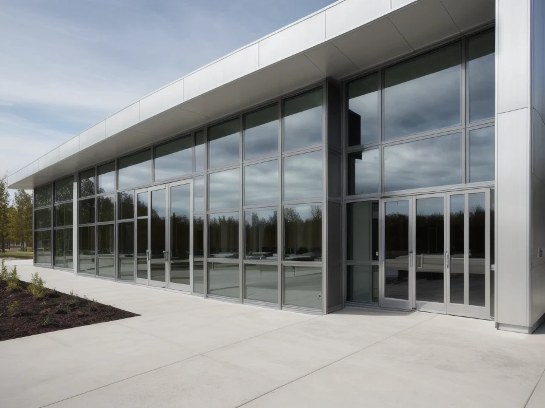 |
| سقف و عایق رطوبتی | 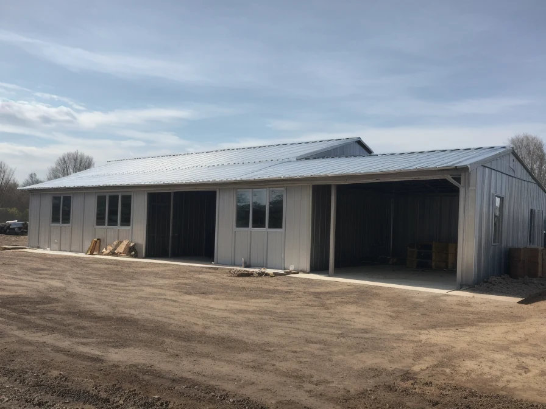 |
| لوازم بهداشتی | 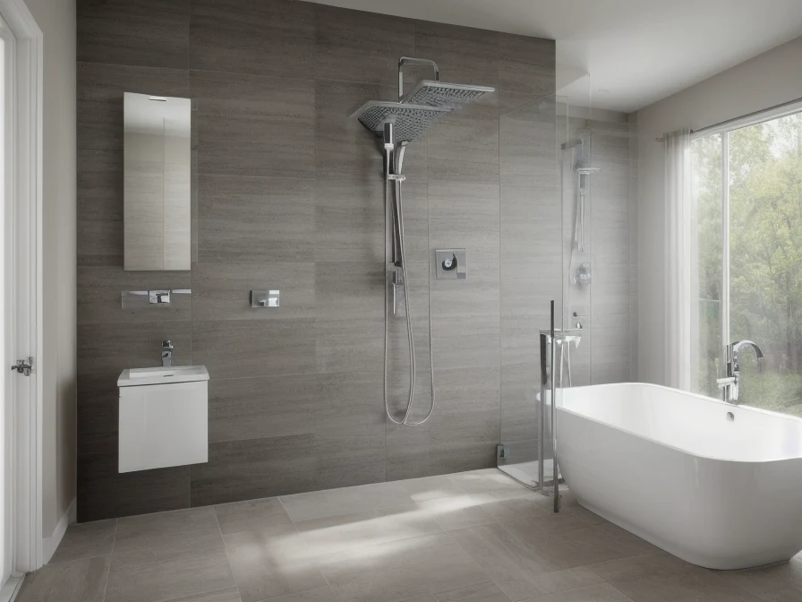 |
| روشنایی و برق | 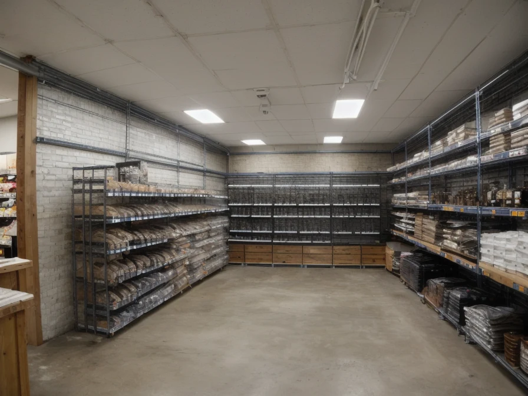 |
| چسب و ملات کاشی | 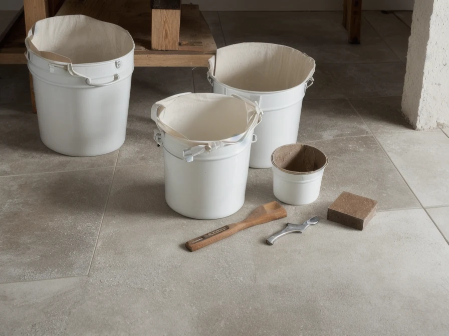 |
| داربست و تجهیزات کارگاهی | 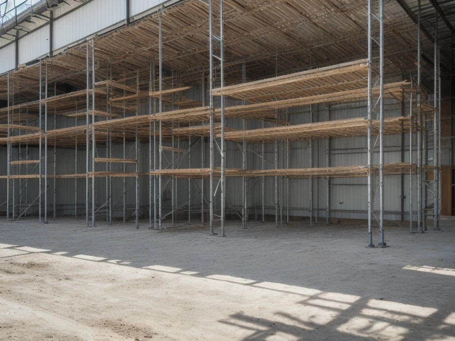 |
| یراق و اتصالات | 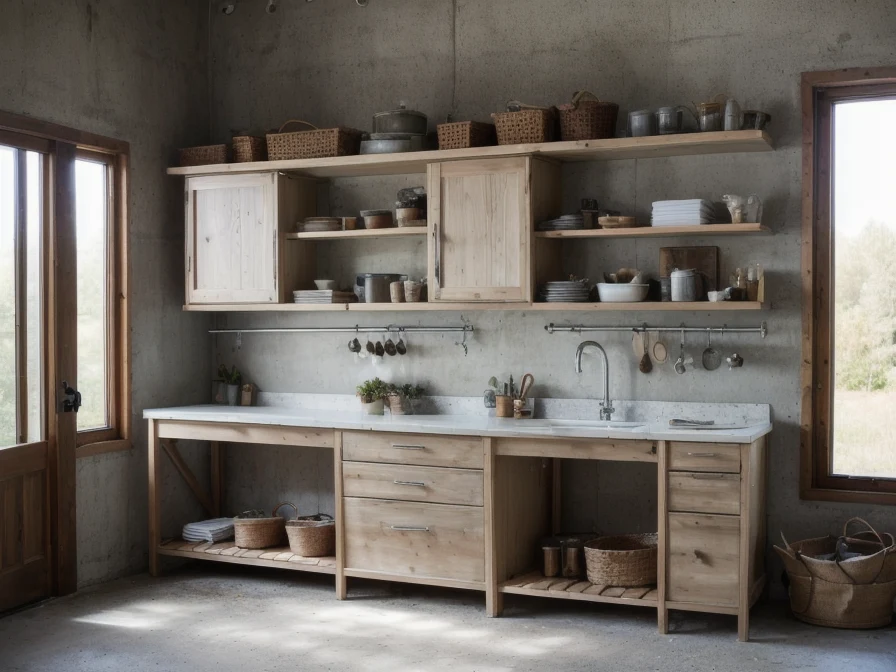 |
| تهویه و HVAC | 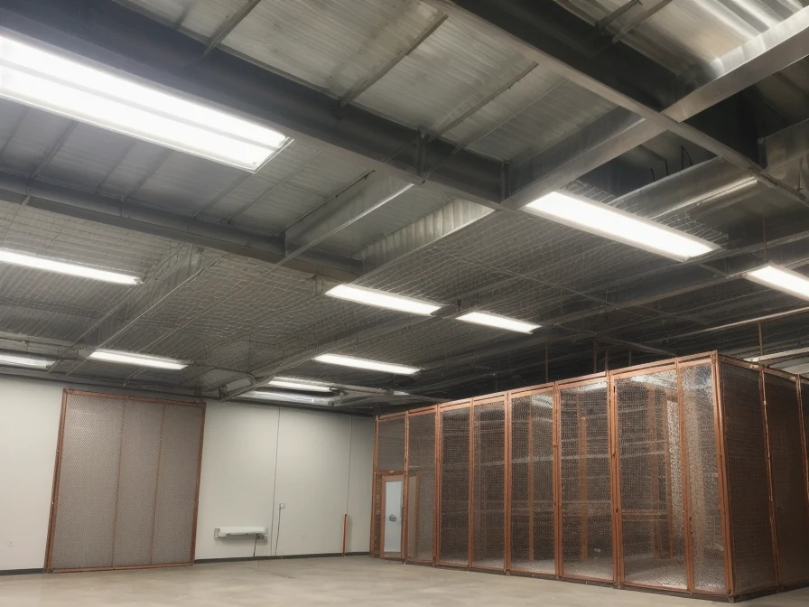 |
| نما و دکوراسیون | 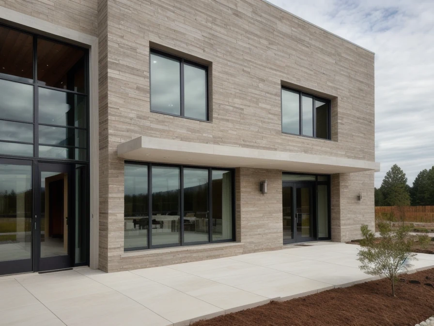 |

Hero واقعی جدید:

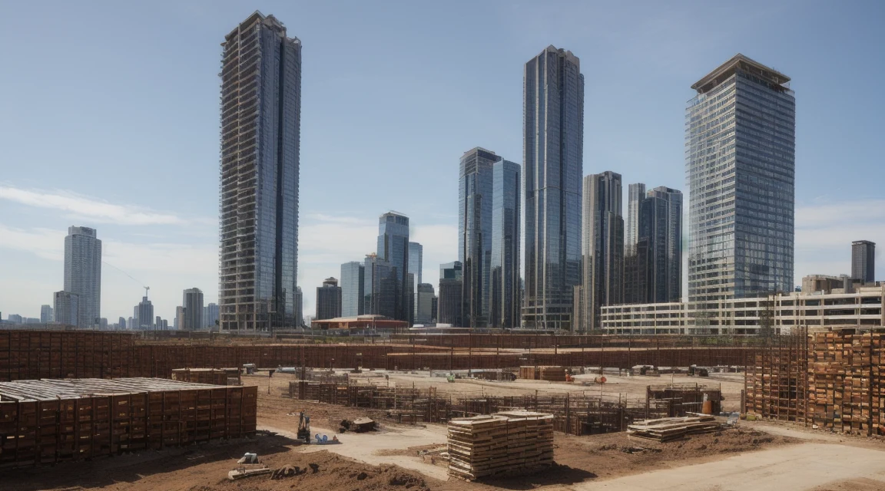
