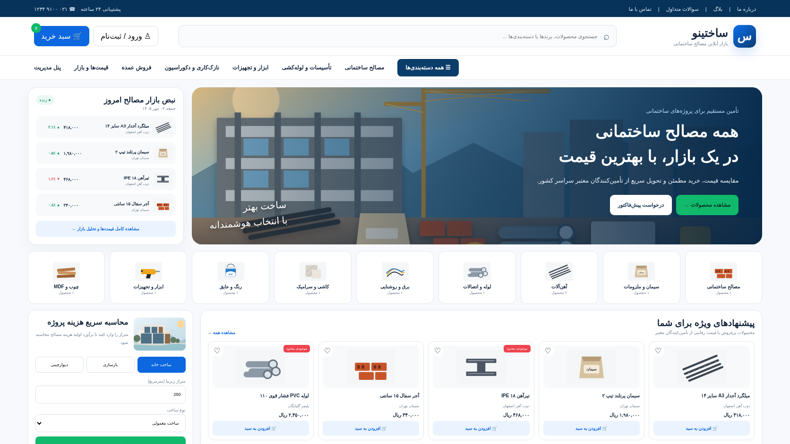
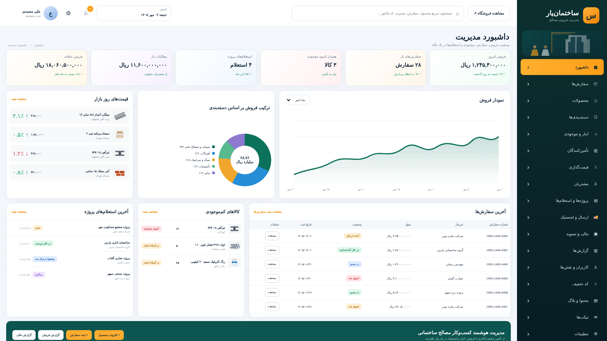
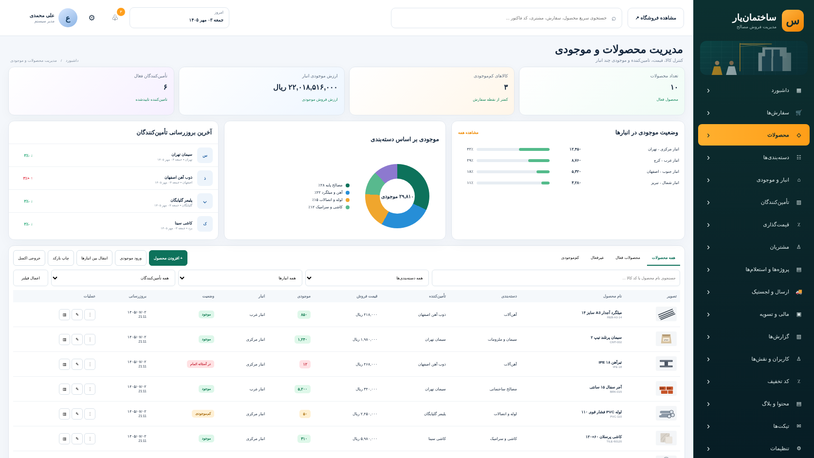
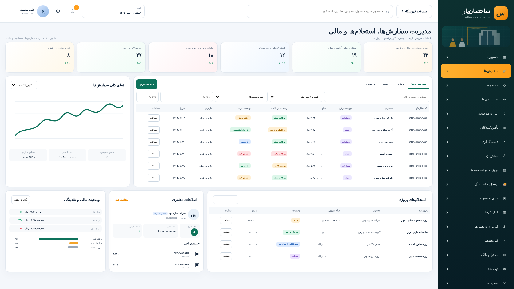

# مستندات UI/UX و پیاده‌سازی

این مستند بر اساس طرح تاییدشده فروشگاه مصالح و پنل مدیریت تهیه شده است. خروجی‌ها مستقیماً از نسخه Laravel + Blade در لوکال گرفته شده‌اند.

## 1. فروشگاه

امکانات: جستجو، دسته‌بندی، قیمت روز مصالح، محصولات ویژه، سبد خرید، محاسبه هزینه پروژه و استعلام پروژه.

## 2. داشبورد مدیریت

امکانات: KPI فروش، نمودار، ترکیب دسته‌بندی، قیمت روز، سفارش‌ها، کمبود موجودی، استعلام پروژه و دسترسی سریع.

## 3. مدیریت محصولات و موجودی

امکانات: فیلتر، جستجو، موجودی چند انبار، تامین‌کنندگان، قیمت فروش، هشدار کمبود موجودی و عملیات گروهی.

## 4. مدیریت سفارش‌ها، استعلام‌ها و مالی

امکانات: سفارش پروژه‌ای/عمده، پرداخت، وضعیت ارسال، باربری، استعلام پروژه، CRM مشتری و وضعیت نقدینگی.

## سیستم طراحی

- جهت: RTL
- فونت: B Yekan از فونت نصب‌شده سیستم، با fallback استاندارد
- فروشگاه: آبی تیره، آبی، سبز
- پنل: سبز تیره، نارنجی، سفید
- کارت‌ها: شعاع 8 تا 18px
- وضعیت‌ها: سبز موفق، نارنجی هشدار، قرمز خطا، آبی اطلاعات
- تاریخ: Jalali
- واحد پول: Rial

## Assetها

- محصولات: `public/assets/img/products/`
- بنرها: `public/assets/img/banners/`
- CSS: `public/assets/css/app.css`
- JavaScript: `public/assets/js/app.js`
- تصاویر خروجی مستندات: `docs/images/`

تمام تصاویر محصولی و بنرهای رابط به‌صورت SVG وکتور هستند تا افت کیفیت نداشته باشند.
